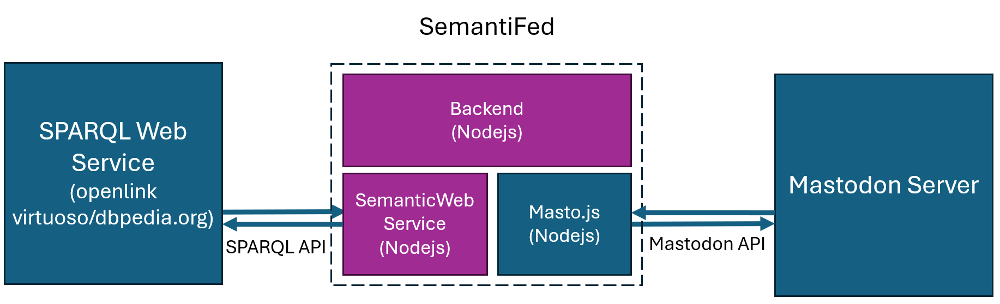

## SeBridge

An agent that lets you access the semantic web through the social web, acting as a bridge between the two.


Connected to the openlink-virtuoso-endpoint based on dbpedia and SPARQL:



- Link to dbpedia: https://dbpedia.org
- Link to endpoint: https://dbpedia.org/sparql
- Link to openlink-virtuoso-documentation for SPARQL-endpoints: https://docs.openlinksw.com/virtuoso/rdfsparqlprotocolendpoint/

## Installation

1. **Clone the Repository**:

2. **Install Dependencies**:

From now on, in the `/app`-folder, run:
   ```bash
   npm install
   ```

3. **Configure Your Host**:

Create a `.env` file to define your environment variables.

Schema of configuration (can also be found at `app/.env.template`:
```env
MASTODON_API_KEY=your-api-key
ACCOUNT_NAME=your-account-name
URL=url-to-my-instance
      
USER_ANSWERING_SCHEDULE="*/3 * * * *" #schedule to answer requests from users
  
SPARQL_ENDPOINT="http://localhost:3030/my-knowledge-base"
SPARQL_QUERY_SUFFIX="/query"
SPARQL_BODY_FORMAT="json"
SPARQL_QUERY_ACCEPT_HEADER="application/trig"
```

Depending on the triple store, the .env-setup might be different, for example:

#### DBPEDIA
- SPARQL_ENDPOINT="https://dbpedia.org"
- SPARQL_QUERY_SUFFIX="/sparql"
- SPARQL_BODY_FORMAT="application/rdf+xml"
- SPARQL_QUERY_ACCEPT_HEADER="application/rdf+xml"

#### APACHE JENA FUSEKI
- SPARQL_ENDPOINT="http://localhost:3030/my-knowledge-base"
- SPARQL_QUERY_SUFFIX="/query"
- SPARQL_BODY_FORMAT="json"
- SPARQL_QUERY_ACCEPT_HEADER="application/trig"

That's it! Your server should be up and running!
